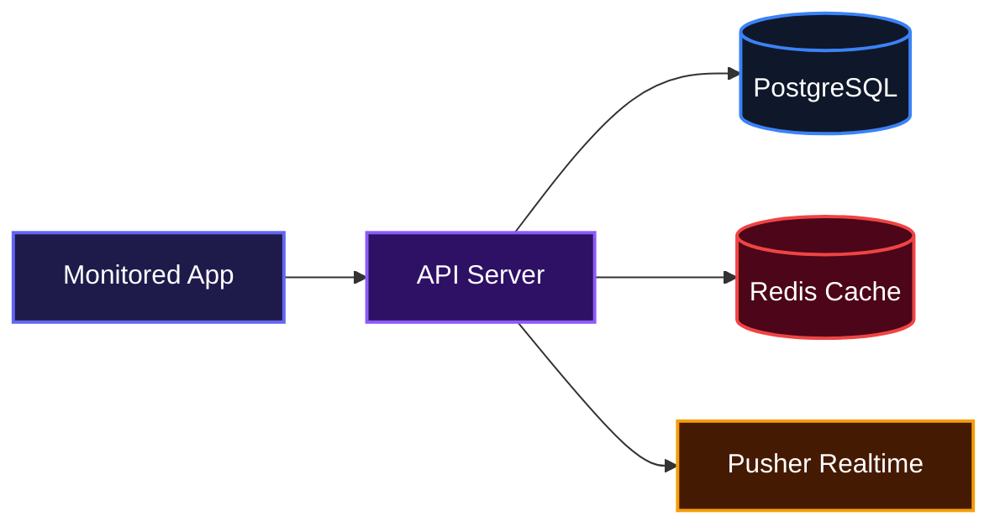
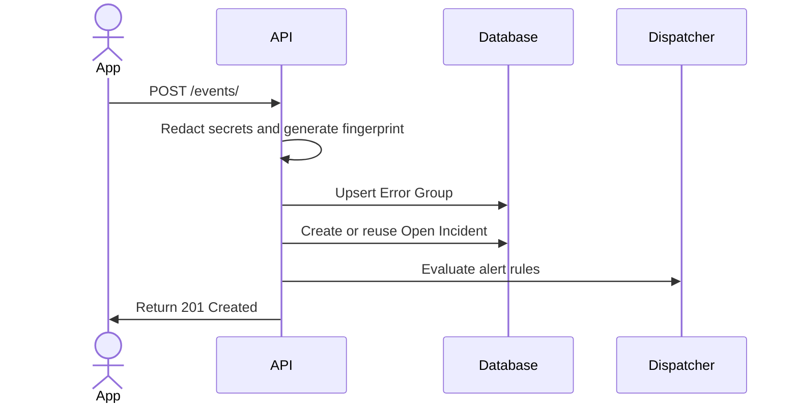
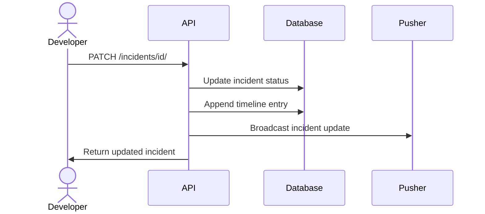

# TrazeIQ Backend

TrazeIQ helps developers track, deduplicate, and resolve errors occurring in their live applications. It takes raw error events, organizes them into actionable incidents, and pushes real-time alerts so teams can respond immediately. The platform provides complete visibility into system health, keeping engineering teams informed without overwhelming them with noise.

## System Architecture



## Features

* **Error Deduplication and Incident Management**: Groups identical error events into a single incident to reduce noise, allowing teams to assign, comment, and resolve issues collaboratively.



* **Multi-Tenant Organizations**: Supports isolated workspaces where teams can manage their own projects, API keys, and role-based access control.
* **Real-Time Event Publishing**: Streams incident updates and new error occurrences directly to connected clients without requiring manual page refreshes.



* **Automated Alert Dispatch**: Routes critical incident notifications to configured channels like Slack, custom Webhooks, and Email based on customizable rules and severity thresholds.
* **Platform Analytics**: Generates time-series data and health metrics to provide teams with an accurate overview of error volume and service uptime.

## Installation

Follow these steps to set up the project locally:

1. Clone the repository:
```bash
git clone https://github.com/FavourDarasimi/TrazeIQ-Backend.git
cd TrazeIQ-Backend
```

2. Create a virtual environment and activate it:
```bash
python -m venv venv
source venv/bin/activate
```

3. Install the required dependencies:
```bash
pip install -r requirements.txt
```

4. Configure your environment variables by copying the example file:
```bash
cp .env.example .env
```

5. Apply database migrations:
```bash
python manage.py migrate
```

6. Start the local development server:
```bash
python manage.py runserver
```

## Usage

Once the server is running, you can ingest errors into the system. To send an error event to the backend, make a POST request with your project API key:

```bash
curl -X POST http://localhost:8000/api/v1/events/ \
  -H "Content-Type: application/json" \
  -H "X-API-Key: YOUR_PROJECT_API_KEY" \
  -d '{"environment": "production", "message": "DatabaseError: connection refused", "level": "fatal"}'
```

You can view the resulting incidents, error groups, and timeline updates by logging into the frontend dashboard and navigating to your project workspace.

## Technologies Used

| Category | Technology |
| --- | --- |
| Core Language | Python |
| Web Framework | Django, Django REST Framework |
| Database | PostgreSQL |
| Caching & Rate Limiting | Redis |
| Real-Time Events | Pusher |
| Authentication | JWT (SimpleJWT) |
| Web Server | Gunicorn, WhiteNoise |

## Contributing

We welcome contributions to the project. To contribute, please fork the repository, create a new branch for your feature or bug fix, and submit a pull request for review. Ensure that your code follows the existing style and includes appropriate tests.

## Author Info

* X (Twitter): https://x.com/code_with_dara

---

[](https://www.python.org/)
[](https://www.djangoproject.com/)
[](https://www.postgresql.org/)
[](https://redis.io/)

[](https://dokugen.samueltuoyo.com)